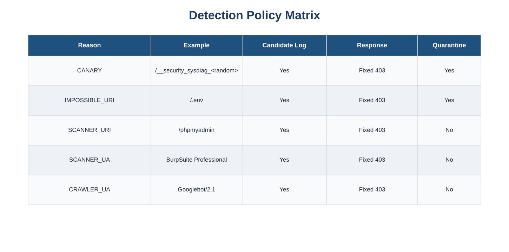
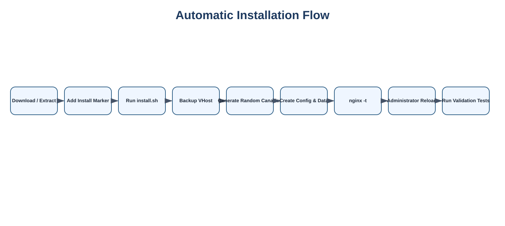
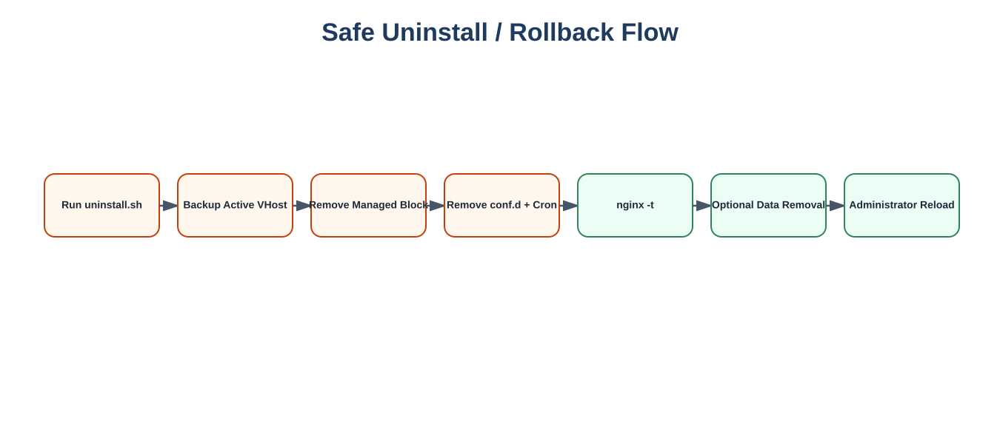

# Nginx Security Tripwire

A lightweight defensive security layer for Nginx that adds:

- Canary / honey URLs
- Impossible URI detection
- Scanner URI detection
- Scanner User-Agent detection
- Optional crawler blocking
- Deterministic 403 responses
- Candidate event logging
- Attacker aggregation
- Cookie-based browser quarantine
- Security dashboard
- Automatic dashboard refresh through cron
- Safe install / uninstall helpers
- Manual installation and removal documentation

> This project is designed to sit in front of an existing Nginx-served application. It does not replace application security controls, WAF/IPS, authentication, authorization, rate limiting, or host firewall rules.


## Visual overview

### Architecture


### Detection and response


### Detection policy



### File and data dependencies


### Automatic installation



### Safe uninstall




## Requirements

- Linux
- Nginx
- Bash
- Python 3
- root privileges
- `cron` service
- Optional: `acl` package for `setfacl/getfacl`

## Supported deployment model

This package is intended for a site that already has a working Nginx HTTPS virtual host.

Example:

```text
Internet
   |
   v
Firewall / Reverse Proxy
   |
   v
Nginx
   |
   +-- Scanner / crawler detection -> deterministic 403
   |
   +-- Canary / impossible URI -> log + quarantine cookie + 403
   |
   +-- Existing quarantine cookie -> deterministic 403
   |
   +-- Normal request -> existing application
```

## Detection categories

| Reason | Example | Candidate log | Quarantine |
|---|---|---:|---:|
| `CANARY` | generated hidden URL | Yes | Yes |
| `IMPOSSIBLE_URI` | `/.env` | Yes | Yes |
| `SCANNER_URI` | `/phpmyadmin` | Yes | No |
| `SCANNER_UA` | `BurpSuite Professional` | Yes | No |
| `CRAWLER_UA` | `Googlebot/2.1` | Yes | No |

## Quick install

1. Copy this repository to the server.
2. Run:

```bash
sudo ./install.sh
```

3. Follow the prompts.
4. Review the generated Nginx integration block.
5. Run:

```bash
sudo nginx -t
sudo systemctl reload nginx
```

The installer **does not reload Nginx automatically** unless you explicitly choose to do so.

## Quick uninstall

```bash
sudo ./uninstall.sh
```

The uninstaller removes only files and marked configuration blocks created by this project.

## Manual installation

See:

```text
docs/MANUAL-INSTALL.md
```

## Manual uninstall

See:

```text
docs/MANUAL-UNINSTALL.md
```

## Generated canaries

The installer creates random canary URLs such as:

```text
/__security_sysdiag_<random>
/__security_backup_<random>
/__security_debug_<random>
/__security_admin_api_<random>
```

Do not publish or link to these URLs.

## Browser quarantine

High-confidence detections can set a cookie:

```text
security_quarantine=1
```

Default level-1 duration:

```text
60 seconds
```

Subsequent requests from the same browser receive a deterministic `403 Forbidden` response until the cookie expires.

Scanner and crawler detections do not create a quarantine cookie by default.

## Security dashboard

Default dashboard URL:

```text
/security/
```

Candidate log endpoint:

```text
/__security_candidates_<random>
```

The candidate endpoint is intentionally unauthenticated by default. If that is not appropriate for your environment, restrict it by IP, HTTP basic authentication, VPN, or remove it entirely.

## Important safety notes

Before installation:

```bash
sudo nginx -t
```

After every Nginx change:

```bash
sudo nginx -t
```

Only reload when syntax validation succeeds:

```bash
sudo systemctl reload nginx
```

Never publish:

- real production IP addresses
- real session identifiers
- `.env`
- TLS private keys
- real candidate logs
- internal topology
- firewall configuration
- production canary URLs

## License

MIT
