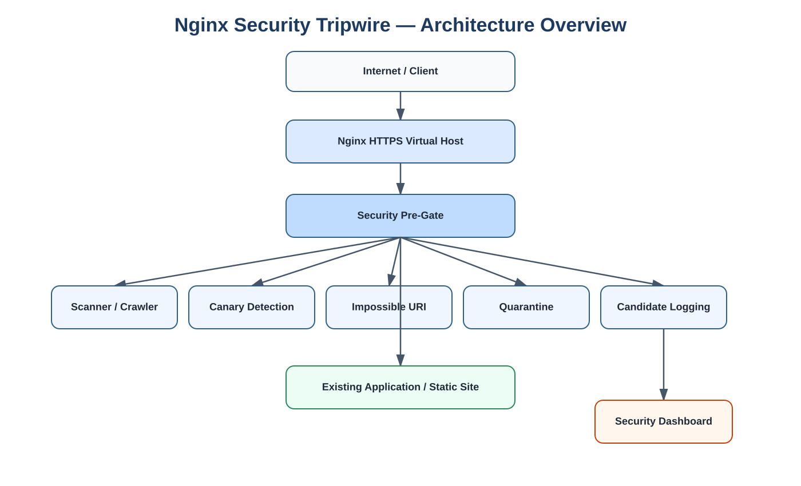
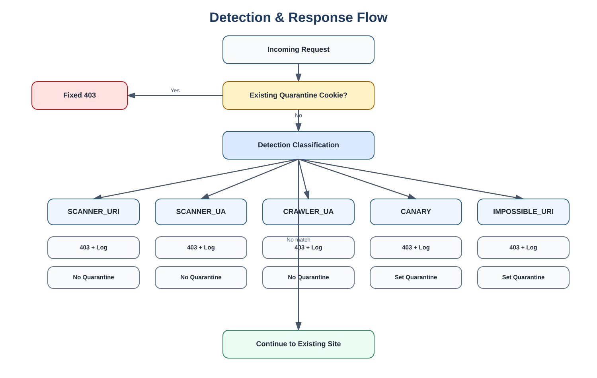
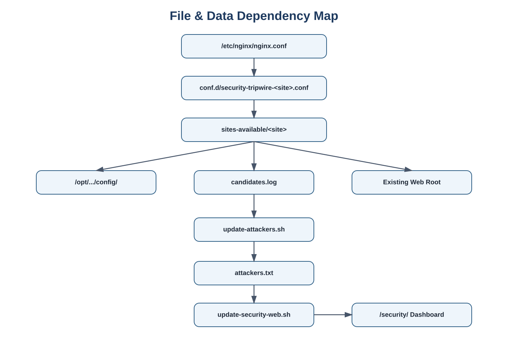

# Architecture







```text
Request
  |
  v
Existing Host/SNI validation
  |
  v
Quarantine check
  |---- active cookie ----> fixed 403
  |
  v
Detection
  |
  +---- scanner URI -----> fixed 403 + candidate log
  |
  +---- scanner UA ------> fixed 403 + candidate log
  |
  +---- crawler UA ------> fixed 403 + candidate log
  |
  +---- canary ----------> fixed 403 + candidate log + quarantine cookie
  |
  +---- impossible URI --> fixed 403 + candidate log + quarantine cookie
  |
  v
Existing site/application
```

## Why deterministic responses?

Different rejection pages can create response-difference signals that vulnerability scanners may misinterpret.

A canonical rejection response reduces response variability for security-blocked traffic.

## Why cookie quarantine?

It temporarily isolates the browser that hit a high-confidence tripwire without blocking every client behind the same NAT address.

It is not a replacement for IP reputation, WAF, firewall, or application session invalidation.
